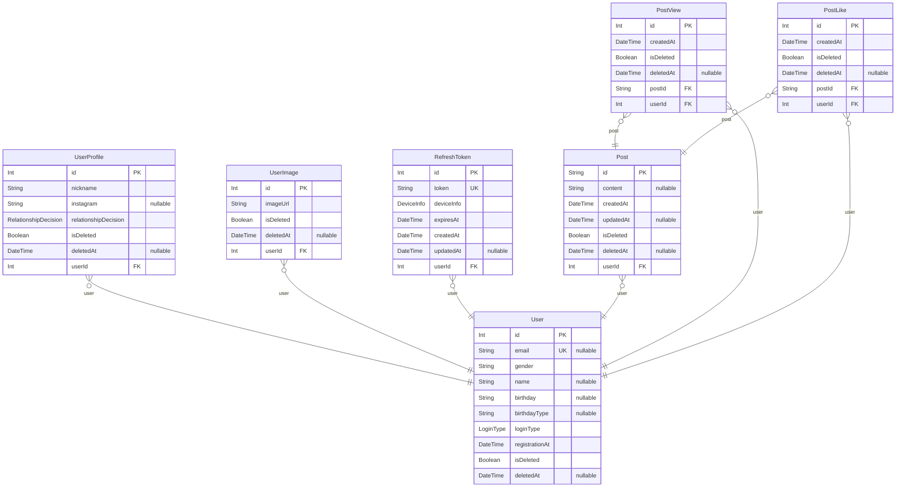

# IbyeolNote
> Generated by [`prisma-markdown`](https://github.com/samchon/prisma-markdown)

- [default](#default)

## default

### `User`

**Properties**
  - `id`: 
  - `email`: 
  - `gender`: 
  - `name`: 
  - `birthday`: 
  - `birthdayType`: 
  - `loginType`: 
  - `registrationAt`: 
  - `isDeleted`: 
  - `deletedAt`: 

### `UserProfile`

**Properties**
  - `id`: 
  - `nickname`: 
  - `instagram`: 
  - `relationshipDecision`: 
  - `isDeleted`: 
  - `deletedAt`: 
  - `userId`: 

### `UserImage`

**Properties**
  - `id`: 
  - `imageUrl`: 
  - `isDeleted`: 
  - `deletedAt`: 
  - `userId`: 

### `RefreshToken`

**Properties**
  - `id`: 
  - `token`: 
  - `deviceInfo`: 
  - `expiresAt`: 
  - `createdAt`: 
  - `updatedAt`: 
  - `userId`: 

### `Post`

**Properties**
  - `id`: 
  - `content`: 
  - `createdAt`: 
  - `updatedAt`: 
  - `isDeleted`: 
  - `deletedAt`: 
  - `userId`: 

### `PostView`

**Properties**
  - `id`: 
  - `createdAt`: 
  - `isDeleted`: 
  - `deletedAt`: 
  - `postId`: 
  - `userId`: 

### `PostLike`

**Properties**
  - `id`: 
  - `createdAt`: 
  - `isDeleted`: 
  - `deletedAt`: 
  - `postId`: 
  - `userId`: 